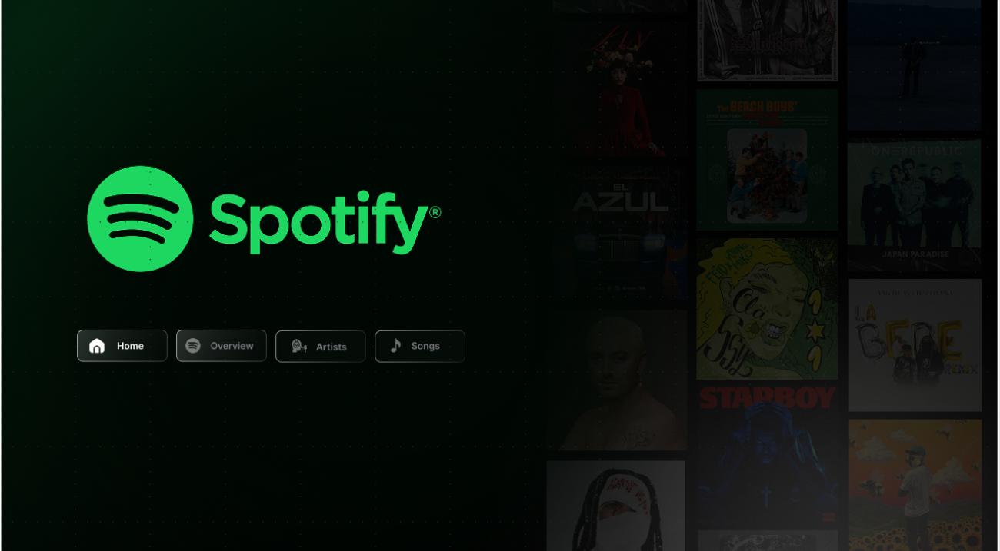
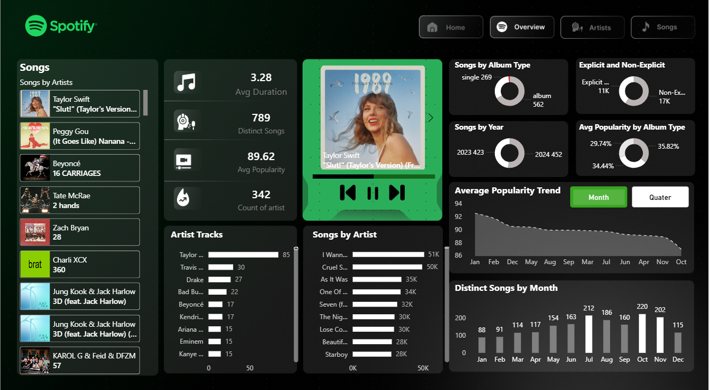
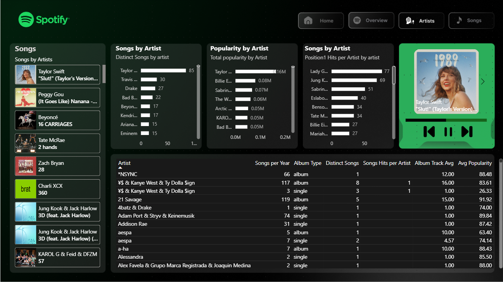
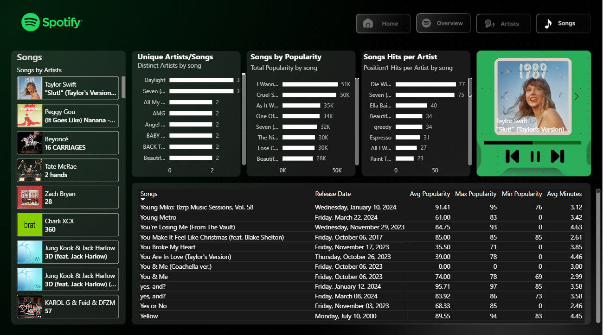

# 🎵 Spotify Analytics Dashboard

## 📌 Project Overview
The Spotify Analytics Dashboard is a Business Intelligence project designed to transform Spotify’s "Top 50" dataset into a structured, data-driven analytics solution.  

This project provides deep insights into song performance, artist analytics, popularity trends, album distribution, and explicit content analysis through an interactive Power BI dashboard.

## 🛠 Tools & Technologies Used
- SQL (Data Extraction & Transformation)
- Python (Data Cleaning & Feature Engineering)
- Microsoft Excel (Exploratory Data Analysis)
- Power BI (Data Modeling & Dashboard Development)
- Figma (Custom Spotify-themed Background Design)

## 📊 Dashboard Features

### 1️⃣ Overview Page
- Total Songs & Distinct Artists
- Average Popularity & Duration
- Explicit vs Non-Explicit Distribution
- Album Type Analysis (Single / Album / Compilation)
- Year-over-Year Growth Tracking
- Monthly Popularity Trends

### 2️⃣ Artist Analytics
- Total Songs per Artist
- Average Popularity per Track
- Album vs Single Contribution
- #1 Position Tracking
- Consistency Scoring

### 3️⃣ Song-Level Insights
- Top Songs by Popularity
- Popularity Distribution Analysis
- Song Longevity & Ranking Trends
- Detailed Track Metadata Analysis

## 📈 Advanced Analytics Implemented
- Popularity Index Normalization
- Artist Consistency Scoring Model
- Monthly Volatility Tracking
- Year-over-Year Growth Analysis
- Explicit Content Performance Correlation

## 🚀 Business Value
This dashboard enables:
- Data-driven marketing decisions
- Playlist optimization
- Artist performance evaluation
- Strategic content planning
- Trend forecasting

## 📂 Repository Structure

Spotify-Analytics-Dashboard
│
├── Spotify_Analytics_Dashboard.pbix
├── data_cleaning.py
├── queries.sql
├── README.md
└── screenshots/

## 📸 Dashboard Preview

### 🏠 Home Tab

### 📊 Overview Tab

### 🎤 Artist Tab

### 🎵 Songs Tabgit pull origin main --allow-unrelated-histories

## 🎥 Dashboard Demo

## 🎥 Dashboard Demo

[Click here to watch demo](screenshots/spotify_dashboard.mp4)

## 📌 How to Use
1. Download the `.pbix` file.
2. Open using Power BI Desktop.
3. Explore interactive filters and drill-through pages.

## 👨‍💻 Author
Your Name  
GitHub: https://github.com/Vedantkale3  
LinkedIn: www.linkedin.com/in/vedant-kale-b75419292

⭐ If you found this project valuable, feel free to star the repository!
